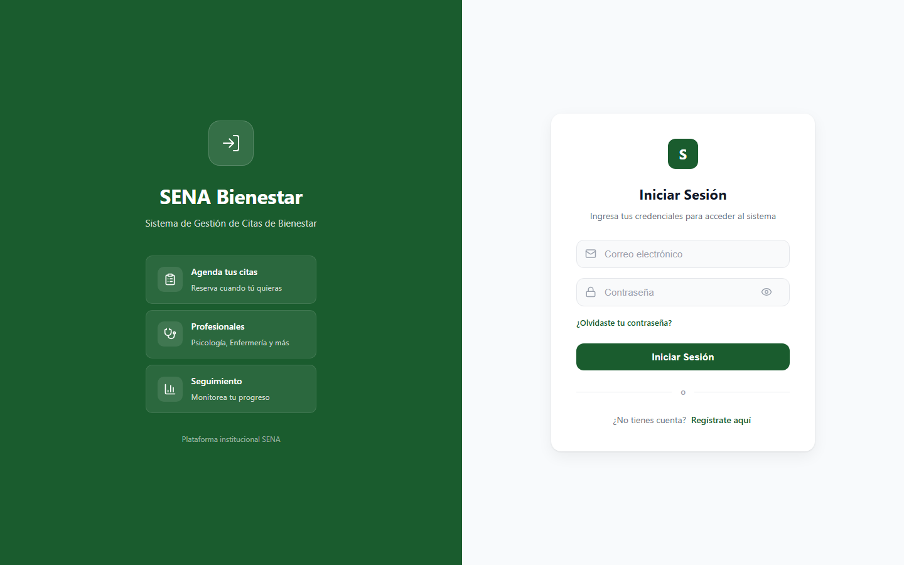
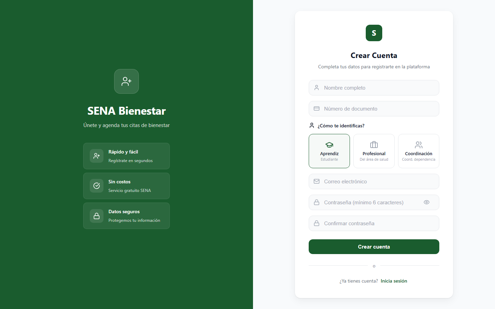
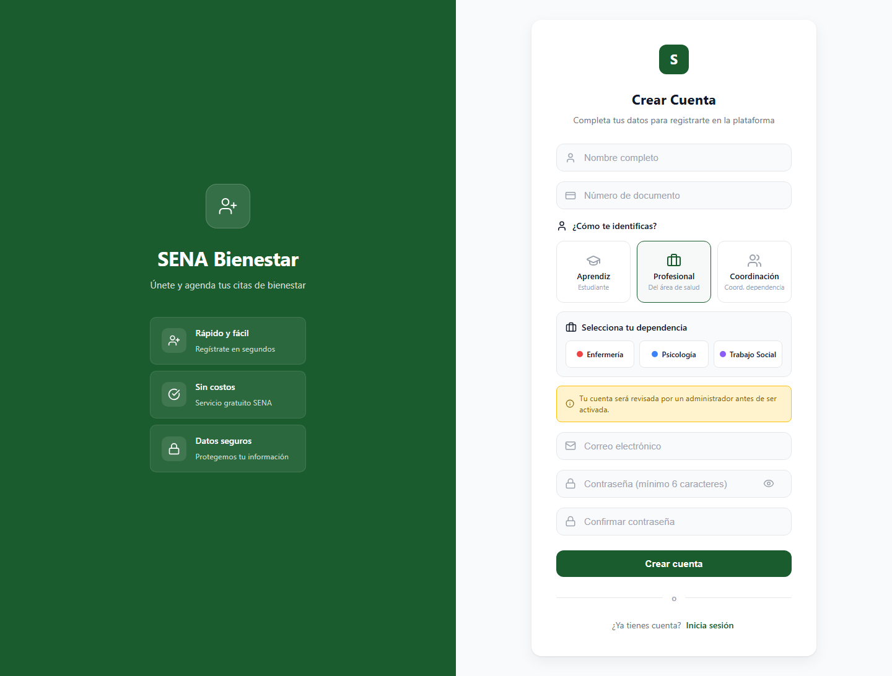
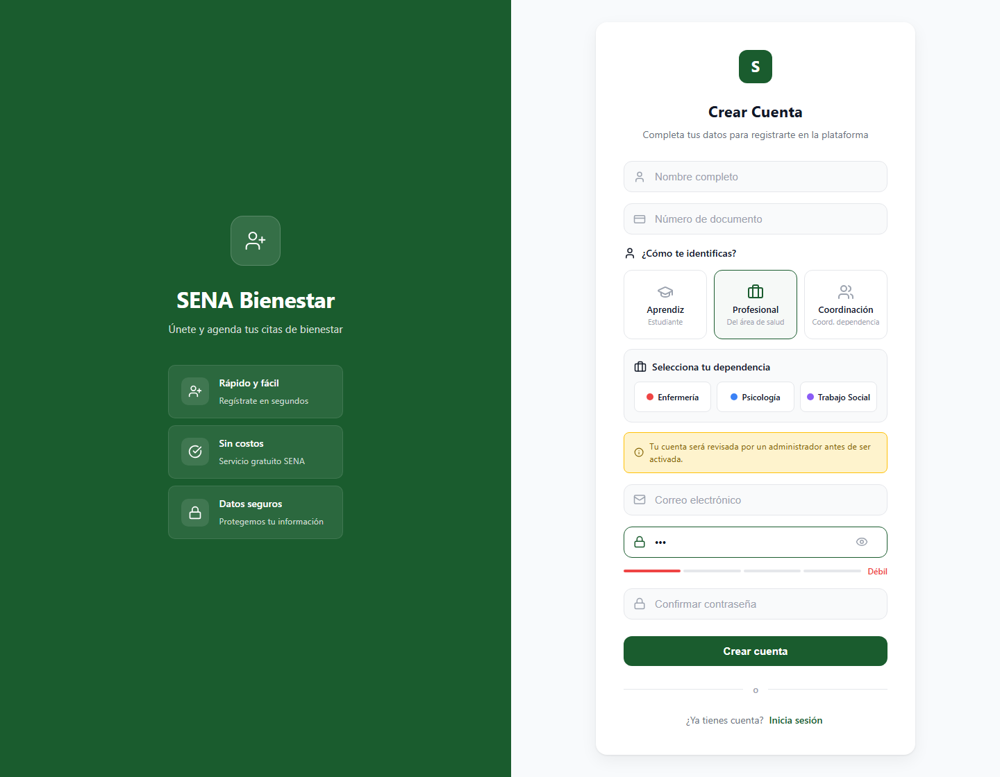

# Manual de Usuario — Sistema de Gestión de Citas de Bienestar SENA

## Índice

1. [Introducción](#1-introducción)
2. [Requisitos del Sistema](#2-requisitos-del-sistema)
3. [Acceso al Sistema](#3-acceso-al-sistema)
4. [Registro de Usuarios](#4-registro-de-usuarios)
5. [Pantalla Principal por Rol](#5-pantalla-principal-por-rol)
6. [Gestión de Citas (Aprendiz)](#6-gestión-de-citas-aprendiz)
7. [Agenda del Profesional](#7-agenda-del-profesional)
8. [Panel de Coordinación](#8-panel-de-coordinación)
9. [Panel de Administración](#9-panel-de-administración)
10. [Configuración de Cuenta](#10-configuración-de-cuenta)
11. [Modo Oscuro](#11-modo-oscuro)
12. [Atajos de Teclado](#12-atajos-de-teclado)
13. [Solución de Problemas](#13-solución-de-problemas)

---

## 1. Introducción

El **Sistema de Gestión de Citas de Bienestar SENA** es una plataforma web que permite a los aprendices del SENA agendar citas con profesionales de bienestar (psicología, enfermería, nutrición, etc.) y facilita la gestión, seguimiento y reporte de estas citas.

### Roles del Sistema

| Rol | Descripción |
|-----|-------------|
| **Aprendiz** | Usuario estándar que agenda y gestiona sus citas de bienestar |
| **Profesional** | Profesional de salud que atiende citas y registra notas clínicas |
| **Coordinación** | Coordinador de dependencia que visualiza métricas y reportes |
| **Super Admin** | Administrador del sistema con acceso total |

---

## 2. Requisitos del Sistema

- **Navegador:** Google Chrome, Firefox, Safari o Edge (versiones recientes)
- **Conexión:** Acceso a internet
- **Resolución mínima:** 1024x768 (escritorio), 375x667 (móvil)

---

## 3. Acceso al Sistema

### Iniciar Sesión

1. Abra su navegador y acceda a la URL del sistema
2. Verá la pantalla de inicio de sesión:

3. Ingrese su **correo electrónico** y **contraseña**
4. Haga clic en **"Iniciar Sesión"**
5. Si los datos son correctos, será redirigido a su dashboard según su rol

### Funcionalidades del Login

- **Mostrar/ocultar contraseña:** Haga clic en el ícono del ojo junto al campo de contraseña
- **¿Olvidó su contraseña?** Haga clic en el enlace "¿Olvidaste tu contraseña?" para recibit un correo de recuperación
- **Crear cuenta:** Si no tiene cuenta, haga clic en "Regístrate aquí"

### Validación de Formulario

Si intenta iniciar sesión con campos vacíos, el sistema mostrará errores de validación:

---

## 4. Registro de Usuarios

### Crear una Cuenta

1. En la pantalla de login, haga clic en **"Regístrate aquí"**
2. Verá el formulario de registro:

3. Complete los campos:
   - **Nombre completo:** Su nombre y apellidos
   - **Número de documento:** Su número de cédula o documento
   - **Correo electrónico:** Un correo válido
   - **Contraseña:** Mínimo 6 caracteres
   - **Confirmar contraseña:** Debe coincidir con la anterior

### Selección de Rol

El sistema le pedirá que se identifique como:

- **Aprendiz:** Estudiante del SENA
- **Profesional:** Profesional del área de salud (requiere selección de dependencia)
- **Coordinación:** Coordinador de dependencia

> **Nota:** Si selecciona "Profesional" o "Coordinación", deberá esperar la aprobación de un administrador antes de que su cuenta sea activada.

### Indicador de Fortaleza de Contraseña

El formulario muestra una barra de fortaleza que indica la seguridad de su contraseña:

- **Débil** (rojo): Menos de 4 caracteres
- **Regular** (amarillo): 4-5 caracteres
- **Buena** (azul): 6-7 caracteres
- **Fuerte** (verde): 8 o más caracteres

---

## 5. Pantalla Principal por Rol

Al iniciar sesión, cada rol ve una pantalla diferente:

| Rol | Pantalla | URL |
|-----|----------|-----|
| Aprendiz | Mis Citas de Bienestar | `/dashboard` |
| Profesional | Agenda del Día | `/professional` |
| Coordinación | Panel de Coordinación | `/coordination` |
| Super Admin | Panel de Administración | `/admin` |

---

## 6. Gestión de Citas (Aprendiz)

### Solicitar una Cita

1. Haga clic en el botón **"+"** (esquina inferior derecha) o en "Agendar Cita"
2. Complete el formulario:
   - **Dependencia:** Seleccione el tipo de servicio (Psicología, Nutrición, etc.)
   - **Fecha:** Seleccione una fecha (mínimo 24 horas de anticipación, sin fines de semana)
   - **Hora:** Seleccione un horario disponible (8:00 AM - 4:30 PM)
   - **Motivo:** Describe brevemente el motivo de su consulta (mínimo 10 caracteres)
3. Haga clic en **"Solicitar Cita"**

> **Importante:** Solo puede tener un máximo de 2 citas pendientes simultáneamente.

### Filtrar Citas

Use las pestañas superiores para filtrar por estado:
- **Todas:** Muestra todas las citas
- **Pendientes:** Citas esperando confirmación
- **Confirmadas:** Citas confirmadas por el profesional
- **Completadas:** Citas ya atendidas
- **Canceladas:** Citas canceladas
- **No asistió:** Citas donde no se presentó

### Cancelar una Cita

Solo puede cancelar citas en estado **Pendiente**:
1. Localice la cita en la lista
2. Haga clic en el botón **"Cancelar"**
3. Confirme la acción

---

## 7. Agenda del Profesional

### Ver Citas del Día

Al acceder, el profesional ve su agenda del día actual con:
- Lista de citas programadas
- Estado de cada cita (pendiente, confirmada)
- Datos del aprendiz que solicitó la cita

### Gestionar Citas

Para cada cita, el profesional puede:
- **Confirmar:** Acepta la cita
- **Completar:** Registra que la cita fue atendida (puede agregar nota clínica)
- **No asistió:** Marca que el aprendiz no se presentó

### Historial y Estadísticas

- **Historial:** Consulta todas las citas anteriores
- **Estadísticas:** Ve métricas como tasa de asistencia, citas del mes, etc.
- **Horarios:** Configura su disponibilidad semanal

---

## 8. Panel de Coordinación

El panel de coordinación muestra:

- **KPIs:** Total de citas, pendientes, tasa de cumplimiento, profesionales activos
- **Gráficas:** Citas por dependencia, tendencia mensual
- **Profesional con más citas:** Tabla de rendimiento

### Filtros Avanzados

Use "Filtros avanzados" para seleccionar un rango de fechas específico.

### Exportar Datos

Haga clic en **"Exportar CSV"** para descargar un reporte en formato CSV.

---

## 9. Panel de Administración

### Gestión de Usuarios

- Ver lista de todos los usuarios
- Buscar por nombre, documento o email
- Filtrar por rol
- Cambiar rol de un usuario
- Asignar dependencia a profesionales
- Activar/desactivar usuarios

### Gestión de Dependencias

- Crear nuevas dependencias
- Editar nombre y color
- Eliminar dependencias

### Roles y Permisos

Visualización de los roles configurados en el sistema.

### Auditoría

Registro de todas las acciones realizadas en el sistema:
- Crear/actualizar/eliminar usuarios
- Gestión de citas
- Cambios de configuración

### Configuración

Ajustes generales del sistema.

---

## 10. Configuración de Cuenta

### Ver Perfil

1. Haga clic en su avatar en la barra lateral
2. Se abrirá el panel de perfil con:
   - Nombre y correo electrónico
   - Rol asignado
   - Dependencia (si aplica)

### Cerrar Sesión

1. Haga clic en su avatar
2. Seleccione **"Cerrar sesión"**

---

## 11. Modo Oscuro

El sistema ofrece un tema oscuro para mayor comodidad visual:

1. Haga clic en el ícono de **sol/luna** en la barra lateral
2. El tema cambiará automáticamente
3. Su preferencia se guarda para futuras sesiones

---

## 12. Atajos de Teclado

| Atajo | Acción |
|-------|--------|
| `Ctrl + K` | Abrir paleta de comandos |
| `Ctrl + B` | Contraer/expandir barra lateral |
| `Escape` | Cerrar modales |

---

## 13. Solución de Problemas

### No puedo iniciar sesión
- Verifique que su correo y contraseña sean correctos
- Use "¿Olvidaste tu contraseña?" para restablecerla
- Contacte al administrador si su cuenta está desactivada

### La página no carga correctamente
- Actualice la página (F5 o Ctrl+R)
- Limpie la caché del navegador
- Verifique su conexión a internet

### No puedo agendar una cita
- Verifique que tenga menos de 2 citas pendientes
- Seleccione una fecha futura (mínimo 24 horas)
- Seleccione un horario en el rango 8:00 AM - 4:30 PM
- Asegúrese de que la dependencia tenga profesionales disponibles

---

*Documento generado automáticamente — Última actualización: Julio 2026*
